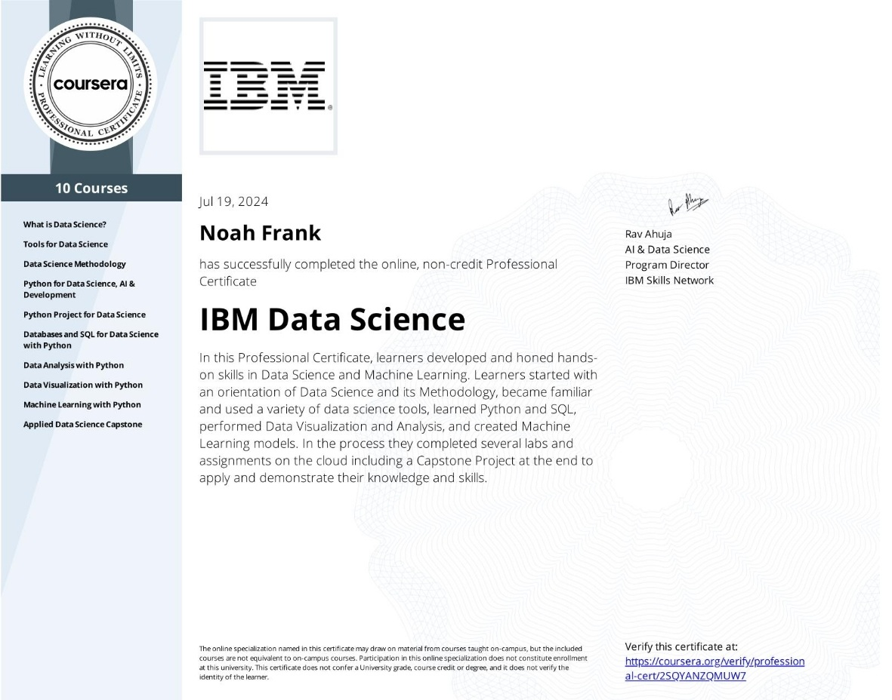
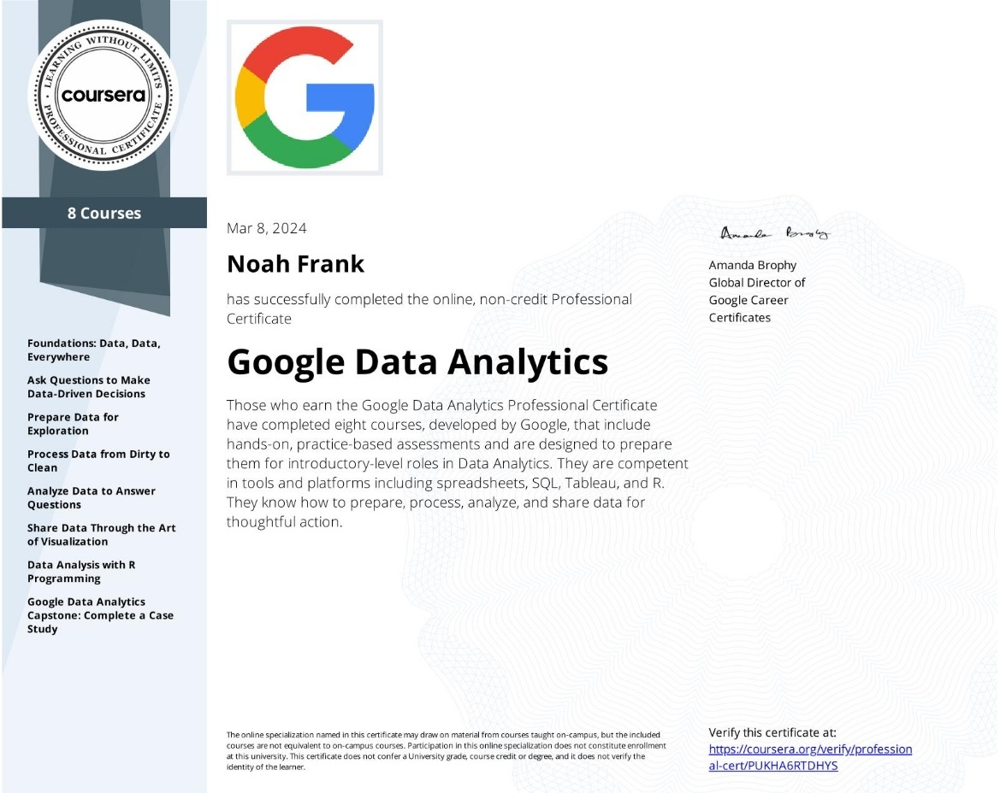

# Noah Frank
<b>Data Analysis/Data Science</b>

## Experience

### Giti Tire - Data Analyst
<b>May 2023 - Present</b>
Worked as a data analyst that brought actionable insights to the organization in the forms of KPIs, scrap material reports, quality assurance, and tire tracking system. 

* Key Performance Indexes (KPIs)
  * Created, maintained, and scheduled KPIs to be sent out on a daily and monthly basis
  * Delivered insights for department managers and plant executives to take action in manufacturing processes
* Scrap material reporting
  * Created scrap reports to assist department leaders and the quality assurance team in pinpointing inefficiencies in production
  * 
* Quality assurance reporting:
* Tire tracking database management:
  * Created and maintained a database of over 34 million scanner records
  * Aggregated data from over 15 database tables
  * Utilized SQL jobs to insert data only a regular basis
* Item inventory program:

---
## Personal Projects

* [Credit Card Fraud Detection Using Neural Networks](https://github.com/noah-frank/noah-frank.github.io/blob/main/Notebooks/credit_card_fraud_detection.ipynb)
  * Performed exploratory data analysis (EDA) on the dataset
  * Oversampled data for equal data representation
  * Achieved high accuracy, precision, and recall with neural networks
* Loan Risk Analysis and Prediction
* [Bank Fraud Detection](https://github.com/noah-frank/portfolio/blob/main/Notebooks/Bank_Fraud_Detection.ipynb)
  * Analyzed the dataset using frequency plotting
  * Created and utilized a transformation pipeline
  * 
* Stock Backtesting Function
* [Optimizing Machine Learning Models](https://github.com/noah-frank/portfolio/blob/main/Notebooks/Optimizing_ML_Models.ipynb)
  * Utilized KNN, SVC, Naive-Bayes, Decision Tree, and Random Forest models from SK-Learn
  * Imrpoved classification

---
## Education 

### MS Data Science - Eastern University
<b>August 2023 - August 2024</b>
* Utilized Python to prepare datasets, explore features, and build machine learning models using SciKit-Learn
* Worked with the R programming language to clean data and visualize key relationships and trends. 
* Studied the many ethical issues surrounding the field of AI and engaged  in constructive debate over issues of privacy and the future of AI. 

### BS Information Systems: Database - Liberty University
<b>September 2020 - May 2023</b>
* Studied SQL programming and how it can be applied in the modern business environment. Applied this knowledge when building a website from scratch using HTML, PHP, and SQL. This included development, iterative improvement, and deployment to the internet. 
* Studied the creation, processes, and management of information systems, applying project management techniques in the development of systems. 

---
## Certificates 

| IBM Data Science Certificate |  Google Data Analytics Certificate |
| ---------------------------- | ---------------------------------- |
|  |  | 

---

 

